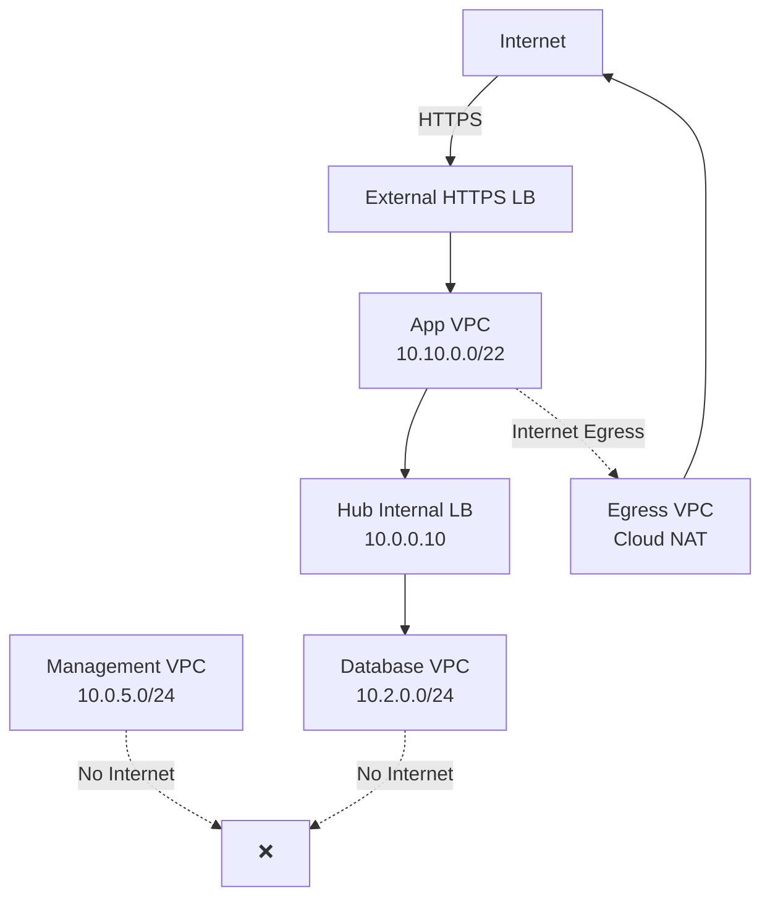

# AI Agent Guidelines for Cloud Network Migration

## Operating Guide for AI Agents in Infrastructure Migration Projects

**Version:** 1.0
**Purpose:** Comprehensive guidelines for operating AI agents to automate cloud network migration tasks

---

## Table of Contents

1. [Introduction](#introduction)
2. [Agent Roles & Responsibilities](#agent-roles--responsibilities)
3. [Safety Principles](#safety-principles)
4. [Agent Workflow](#agent-workflow)
5. [Task Types & Capabilities](#task-types--capabilities)
6. [Input/Output Specifications](#inputoutput-specifications)
7. [Error Handling & Recovery](#error-handling--recovery)
8. [Quality Assurance](#quality-assurance)
9. [Human-in-the-Loop](#human-in-the-loop)
10. [Best Practices](#best-practices)

---

## Introduction

### What is an AI Agent in This Context?

An **AI agent** is an autonomous or semi-autonomous software system powered by large language models (LLMs) that assists in cloud network migration by:

- **Reading and analyzing** existing infrastructure configurations
- **Generating Infrastructure-as-Code** (Terraform, Pulumi, CloudFormation)
- **Validating connectivity and security** through automated testing
- **Creating documentation** (diagrams, runbooks, reports)
- **Monitoring migrations** and alerting on anomalies

### Supported AI Platforms

This toolkit is designed to work with:

- **Claude (Anthropic):** Excellent for code generation, analysis, and structured outputs
- **GPT-4 (OpenAI):** Strong general capabilities, API integration
- **Gemini (Google):** Native GCP integration, code understanding
- **Custom models:** Any LLM with function calling and code generation

### Key Capabilities Required

Your AI agent should support:

- [x] **Multi-turn conversations** (maintain context across multiple prompts)
- [x] **Structured output** (JSON, YAML, Terraform HCL)
- [x] **Code generation** (Terraform, bash scripts, Python)
- [x] **File reading** (parse XML, JSON, YAML firewall exports)
- [x] **Tool use** (optional: execute gcloud commands, run terraform plan)

---

## Agent Roles & Responsibilities

### Primary Roles

#### 1. Configuration Analyst

**Responsibilities:**
- Parse firewall configuration exports (XML, JSON, API responses)
- Extract security rules, NAT policies, address groups
- Map firewall zones to cloud VPC architecture
- Identify dependencies and traffic flows

**Example Task:**
```
Analyze this Palo Alto Panorama export and extract all NAT rules.
For each rule, provide:
  - Source zone
  - Destination zone
  - Original destination port
  - Translated destination IP and port
  - Service/application
```

**Output:**
```json
{
  "nat_rules": [
    {
      "name": "web-service-nat",
      "source_zone": "untrust",
      "destination_zone": "dmz",
      "original_port": 8080,
      "translated_ip": "10.0.1.10",
      "translated_port": 443,
      "protocol": "TCP"
    }
  ]
}
```

---

#### 2. Infrastructure Code Generator

**Responsibilities:**
- Generate Terraform/Pulumi modules for VPCs, subnets, firewall rules
- Create load balancer configurations
- Produce Cloud NAT and VPN gateway configs
- Follow cloud provider best practices

**Example Task:**
```
Generate Terraform code for a GCP VPC with these requirements:
  - Name: vpc-management
  - CIDR: 10.0.5.0/24
  - Subnets:
    - bastion: 10.0.5.0/27 (europe-west1)
    - vpn: 10.0.5.32/27 (europe-west1)
  - Firewall rules:
    - Allow IAP (35.235.240.0/20) to tag:bastion on TCP 22
    - Deny all internet egress (0.0.0.0/0) with logging
  - Private Google Access: enabled
```

**Output:** See `templates/terraform/vpc-module.tf` for example

---

#### 3. Security Validator

**Responsibilities:**
- Verify firewall rule parity (legacy vs cloud)
- Check for unintended allows (e.g., 0.0.0.0/0 ingress)
- Validate architecture-enforced isolation (e.g., database VPC has no internet route)
- Generate compliance reports

**Example Task:**
```
Validate this Terraform plan for security issues:
  - Check for overly permissive rules (source: 0.0.0.0/0 on non-standard ports)
  - Verify database VPC has no route to 0.0.0.0/0
  - Ensure hierarchical policies cannot be overridden by VPC rules
  - Flag any firewall rules without logging enabled
```

**Output:**
```markdown
## Security Validation Report

### Critical Issues
- ❌ Rule `allow-all-http` permits 0.0.0.0/0 → 0.0.0.0/0 on TCP 80 (overly permissive)

### Warnings
- ⚠️ Rule `app-egress` allows tag:app → 0.0.0.0/0 on TCP 443 (consider narrowing to specific FQDNs)

### Passed Checks
- ✅ Database VPC has no route to 0.0.0.0/0
- ✅ All deny rules have logging enabled
- ✅ Hierarchical policies deployed at org level (priority 100-1000)
```

---

#### 4. Test Generator

**Responsibilities:**
- Create connectivity test scripts (bash, Python, gcloud)
- Generate security negative tests (verify denies work)
- Produce performance benchmarking scripts
- Build CI/CD pipelines for automated testing

**Example Task:**
```
Generate a bash script to test connectivity from app VPC to web VPC via hub internal LB.

Test requirements:
  - SSH to app-instance via IAP
  - Curl hub internal LB VIP (10.0.0.20:443)
  - Expected: HTTP 200 OK with web service response
  - If fails: Output error message and exit code 1
```

**Output:** See `templates/tests/connectivity-test.sh` for example

---

#### 5. Documentation Writer

**Responsibilities:**
- Generate network diagrams (Mermaid, draw.io XML)
- Create runbooks for common operations
- Write architecture decision records (ADRs)
- Produce migration reports

**Example Task:**
```
Create a Mermaid network diagram showing:
  - 4 VPCs: management, hub, egress, app
  - VPC peering connections
  - Firewall rule flow (external → LB → app VPC → hub ILB → database VPC)
  - Indicate which traffic paths have internet access
```

**Output:**


---

## Safety Principles

### Critical Safety Rules

AI agents MUST adhere to these principles to prevent production outages:

#### 1. Read-Only on Production

**Rule:** Agents NEVER execute destructive commands on existing production environments.

**Allowed:**
- Read firewall configs (`gcloud compute firewall-rules list`)
- Parse configuration exports
- Analyze VPC routes
- Review IAM policies

**Prohibited:**
- Modify firewall rules
- Delete VPCs or subnets
- Change routing tables
- Update load balancer backends

**Implementation:**
```python
# In agent code
if environment == "production":
    if action in ["create", "update", "delete"]:
        raise PermissionError("Agent cannot modify production. Use shadow environment.")
```

---

#### 2. Separate Shadow Environment

**Rule:** All agent-generated infrastructure deploys to an isolated project/account.

**Pattern:**
```
Production Project: company-prod (DO NOT TOUCH)
Shadow Project: company-network-shadow (agent can deploy here)
```

**Validation:**
```bash
# Before agent executes terraform apply
if [[ $GCP_PROJECT == *"prod"* ]]; then
  echo "ERROR: Agent cannot deploy to production project"
  exit 1
fi
```

---

#### 3. Human Approval Gates

**Rule:** Critical actions require explicit human approval before execution.

**Approval Required For:**
- Deploying Terraform (apply)
- Updating hierarchical firewall policies
- Modifying DNS records
- Executing cutover scripts

**Approval NOT Required For:**
- Generating Terraform code (terraform plan)
- Running read-only tests
- Creating documentation
- Analyzing logs

**Implementation:**
```markdown
Agent workflow:
1. Agent generates Terraform code
2. Agent runs `terraform plan` (read-only)
3. Agent outputs plan summary: "5 resources to create, 0 to change, 0 to destroy"
4. Agent asks: "Approve deployment? (yes/no)"
5. Human reviews and approves
6. Agent executes `terraform apply`
```

---

#### 4. Incremental Validation

**Rule:** Each phase must pass validation before proceeding to next phase.

**Validation Gates:**
- Phase 1: IAP access works, no internet from management VPC
- Phase 2: External LB health checks green, egress via NAT works
- Phase 3: Database VPC has no internet route (automated test)
- Phase 4: All connectivity tests pass (100% success rate)
- Phase 5: Parallel run shows <10% latency difference

**Implementation:**
```python
def execute_phase(phase_number):
    # 1. Deploy infrastructure
    agent.deploy_infrastructure(phase_number)

    # 2. Run validation tests
    results = agent.run_validation_tests(phase_number)

    # 3. Check pass/fail criteria
    if results.pass_rate < 100%:
        agent.alert_human("Phase {phase_number} validation failed. Blocking next phase.")
        return False

    # 4. Proceed only if all tests pass
    return True
```

---

## Agent Workflow

### Standard Agent Lifecycle

```
┌─────────────────────────────────────────────┐
│ 1. Receive Task                             │
│    (Human provides prompt + input files)    │
└──────────────────┬──────────────────────────┘
                   ↓
┌─────────────────────────────────────────────┐
│ 2. Analyze Input                            │
│    - Parse firewall export                  │
│    - Understand requirements                │
│    - Identify dependencies                  │
└──────────────────┬──────────────────────────┘
                   ↓
┌─────────────────────────────────────────────┐
│ 3. Generate Output                          │
│    - Terraform code                         │
│    - Test scripts                           │
│    - Documentation                          │
└──────────────────┬──────────────────────────┘
                   ↓
┌─────────────────────────────────────────────┐
│ 4. Self-Validate                            │
│    - Check syntax (terraform validate)      │
│    - Verify best practices                  │
│    - Run linter (tflint, shellcheck)        │
└──────────────────┬──────────────────────────┘
                   ↓
┌─────────────────────────────────────────────┐
│ 5. Human Review                             │
│    - Agent presents output                  │
│    - Human approves or requests changes     │
└──────────────────┬──────────────────────────┘
                   ↓
┌─────────────────────────────────────────────┐
│ 6. Execute (if approved)                    │
│    - Deploy to shadow environment           │
│    - Run automated tests                    │
└──────────────────┬──────────────────────────┘
                   ↓
┌─────────────────────────────────────────────┐
│ 7. Report Results                           │
│    - Validation results (pass/fail)         │
│    - Recommendations                        │
│    - Next steps                             │
└─────────────────────────────────────────────┘
```

---

## Task Types & Capabilities

### Task Type Matrix

| Task Type | Input | Output | Validation | Example |
|-----------|-------|--------|------------|---------|
| **Config Parsing** | Firewall export (XML/JSON) | Structured data (JSON/YAML) | Schema validation | Parse Panorama export |
| **Code Generation** | Requirements (Markdown) | Terraform/Pulumi code | `terraform validate`, linter | Generate VPC module |
| **Security Analysis** | Firewall rules (JSON) | Compliance report (Markdown) | Policy checks | Detect overly permissive rules |
| **Test Creation** | Network topology, requirements | Bash/Python scripts | Shellcheck, pytest | Generate connectivity tests |
| **Log Analysis** | VPC Flow Logs, firewall logs | Anomaly report (Markdown) | Statistical validation | Compare legacy vs cloud logs |
| **Documentation** | Infrastructure config | Diagrams, runbooks | Diagram syntax check | Generate Mermaid diagram |

### Detailed Task Capabilities

#### Config Parsing

**Input formats supported:**
- Palo Alto Panorama XML export
- Fortinet FortiGate JSON config
- Checkpoint API responses
- AWS Security Group JSON (via aws ec2 describe-security-groups)
- Azure NSG ARM templates

**Output format:**
```json
{
  "firewall_rules": [
    {
      "name": "allow-web-traffic",
      "source_zone": "untrust",
      "destination_zone": "dmz",
      "source_ips": ["0.0.0.0/0"],
      "destination_ips": ["10.0.1.0/24"],
      "service": "HTTPS",
      "action": "allow",
      "logging": true
    }
  ],
  "nat_rules": [...],
  "address_groups": [...]
}
```

---

#### Code Generation

**Terraform Best Practices:**

- Use modules for reusability
- Separate network, security, compute configs
- Use variables for environment-specific values
- Enable state locking (GCS backend with locking)
- Tag all resources (environment, owner, cost-center)

**Example Module Structure:**
```
modules/
├── vpc/
│   ├── main.tf         # VPC, subnets
│   ├── variables.tf    # Input variables
│   ├── outputs.tf      # VPC ID, subnet IDs
│   └── README.md       # Usage docs
├── firewall/
│   ├── main.tf         # Firewall rules
│   ├── variables.tf
│   └── outputs.tf
└── load-balancer/
    ├── main.tf         # External/internal LBs
    ├── variables.tf
    └── outputs.tf
```

**Code Quality Checks:**
```bash
# Agent runs these before outputting code
terraform fmt -check       # Check formatting
terraform validate         # Validate syntax
tflint                     # Lint Terraform code
checkov -f main.tf         # Security scanning
```

---

## Input/Output Specifications

### Input Data Schema

#### Firewall Export Schema (JSON)

```json
{
  "firewall_vendor": "palo_alto | fortinet | checkpoint",
  "export_date": "2025-01-15T10:30:00Z",
  "firewall_rules": [
    {
      "rule_id": "rule-001",
      "name": "allow-web-traffic",
      "source_zone": "untrust",
      "destination_zone": "dmz",
      "source_addresses": ["any"],
      "destination_addresses": ["web-servers"],
      "services": ["HTTP", "HTTPS"],
      "action": "allow",
      "logging": true
    }
  ],
  "nat_rules": [
    {
      "nat_id": "nat-001",
      "type": "destination_nat",
      "original_port": 8080,
      "translated_ip": "10.0.1.10",
      "translated_port": 443
    }
  ],
  "address_groups": [
    {
      "name": "web-servers",
      "type": "ip",
      "members": ["10.0.1.10", "10.0.1.11"]
    }
  ]
}
```

---

#### Network Topology Schema

```yaml
vpcs:
  - name: vpc-management
    cidr: 10.0.5.0/24
    region: us-central1
    subnets:
      - name: bastion
        cidr: 10.0.5.0/27
        private_google_access: true
    peering:
      - target_vpc: vpc-hub
        import_routes: true
        export_routes: false

  - name: vpc-hub
    cidr: 10.0.0.0/20
    region: us-central1
    subnets:
      - name: hub-ilb
        cidr: 10.0.0.0/25
    peering:
      - target_vpc: vpc-management
      - target_vpc: vpc-app
      - target_vpc: vpc-database

firewall_rules:
  - name: mgmt-allow-iap
    direction: INGRESS
    priority: 1000
    source_ranges: ["35.235.240.0/20"]
    target_tags: ["bastion"]
    allowed:
      - protocol: tcp
        ports: ["22"]
    logging: true
```

---

### Output Specifications

#### Terraform Output

**Requirements:**
- Valid HCL syntax (no errors in `terraform validate`)
- Modular design (use modules for VPCs, firewalls, LBs)
- Variables for environment-specific values
- Outputs for resource IDs (VPC ID, subnet IDs, LB IPs)
- Comments explaining non-obvious configurations

**Template:**
```hcl
# modules/vpc/main.tf

resource "google_compute_network" "vpc" {
  name                    = var.vpc_name
  auto_create_subnetworks = false
  routing_mode            = "REGIONAL"
}

resource "google_compute_subnetwork" "subnet" {
  for_each = var.subnets

  name          = each.key
  ip_cidr_range = each.value.cidr
  region        = var.region
  network       = google_compute_network.vpc.id

  private_ip_google_access = each.value.private_google_access

  log_config {
    aggregation_interval = "INTERVAL_5_SEC"
    flow_sampling        = 0.5
    metadata             = "INCLUDE_ALL_METADATA"
  }
}
```

---

#### Test Script Output

**Requirements:**
- Exit code 0 on success, non-zero on failure
- Clear output messages (PASS/FAIL for each test)
- Logs errors with context (which resource failed, why)
- Supports dry-run mode (validate without executing)

**Template:**
```bash
#!/bin/bash
# connectivity-test.sh

set -euo pipefail

echo "=== Connectivity Test Suite ==="

# Test 1: External LB reachable
echo -n "Test 1: External LB HTTPS... "
if curl -s -o /dev/null -w "%{http_code}" https://lb.example.com | grep -q "200"; then
  echo "PASS"
else
  echo "FAIL (Expected HTTP 200)"
  exit 1
fi

# Test 2: IAP SSH to bastion
echo -n "Test 2: IAP SSH to bastion... "
if gcloud compute ssh bastion --tunnel-through-iap --command="echo success" 2>/dev/null | grep -q "success"; then
  echo "PASS"
else
  echo "FAIL (IAP tunnel failed)"
  exit 1
fi

echo "=== All tests passed ==="
exit 0
```

---

## Error Handling & Recovery

### Common Errors and Resolutions

#### Error Type 1: Terraform Syntax Error

**Symptom:**
```
Error: Unsupported block type
on main.tf line 15:
  15: invalid_block {
```

**Agent Response:**
```markdown
I detected a Terraform syntax error in the generated code.

**Issue:** Invalid block type `invalid_block` on line 15.
**Cause:** Likely a typo or unsupported resource type.
**Fix:** Correcting to `google_compute_firewall` block.

Regenerating code...
```

---

#### Error Type 2: Validation Test Failed

**Symptom:**
```
Test 3: Database isolation test... FAIL (curl to google.com succeeded, expected timeout)
```

**Agent Response:**
```markdown
⚠️ **Validation Failure:** Database VPC has unintended internet route.

**Root Cause Analysis:**
- VPC peering to vpc-egress exports default route (0.0.0.0/0)
- Database VPC imported this route

**Recommended Fix:**
1. Remove VPC peering: vpc-database ↔ vpc-egress
2. Ensure database VPC peers only with: vpc-hub, vpc-shared, vpc-management
3. Re-run validation test

**Terraform change required:**
\`\`\`hcl
# Remove this peering
# resource "google_compute_network_peering" "db_to_egress" {
#   network      = google_compute_network.vpc_database.id
#   peer_network = google_compute_network.vpc_egress.id
# }
\`\`\`

Proceed with fix? (yes/no)
```

---

### Agent Self-Healing

**Scenarios where agent can auto-fix:**

1. **Terraform formatting:** Run `terraform fmt -recursive`
2. **Missing dependencies:** Add required provider versions
3. **Syntax errors:** Regenerate code with corrections
4. **Lint warnings:** Apply shellcheck / tflint suggestions

**Scenarios requiring human intervention:**

1. **Ambiguous requirements:** "Should database VPC peer with egress or not?"
2. **Security decisions:** "Allow 0.0.0.0/0 on this port, or narrow to specific IPs?"
3. **Business logic:** "Which services need external LBs vs internal-only?"

**Agent Decision Tree:**
```
Error detected
    ↓
Is error auto-fixable? (syntax, formatting, known issue)
    ├─ Yes → Auto-fix and regenerate
    └─ No → Escalate to human with context + recommendations
```

---

## Quality Assurance

### Pre-Deployment Checks

Before agent outputs any code, it must pass:

#### 1. Syntax Validation

```bash
# Terraform
terraform validate
terraform fmt -check

# Bash scripts
shellcheck script.sh

# Python scripts
python -m py_compile script.py
```

---

#### 2. Security Scanning

```bash
# Terraform security scan
checkov -f main.tf --framework terraform

# Example output:
Passed checks: 12
Failed checks: 2
  - CKV_GCP_2: Ensure VPC flow logs are enabled
  - CKV_GCP_26: Ensure firewall rule logging is enabled
```

**Agent action if security check fails:**
- Fix automatically if possible (e.g., add `log_config` block)
- Alert human if fix requires decision (e.g., "Enable flow logs? May increase costs")

---

#### 3. Best Practice Compliance

**Checklist:**
- [ ] All resources tagged (environment, owner, cost-center)
- [ ] Firewall rules have logging enabled
- [ ] VPC Flow Logs enabled (if required by policy)
- [ ] Private Google Access enabled on subnets
- [ ] Cloud NAT logging enabled
- [ ] Load balancer health checks configured
- [ ] SSL certificates managed (not self-signed)

---

### Post-Deployment Validation

After deploying to shadow environment:

#### 1. Connectivity Validation

```bash
# Run automated test suite
./tests/connectivity/external-lb-tests.sh
./tests/connectivity/east-west-tests.sh
./tests/egress/saas-connectivity-tests.sh
```

**Expected:** 100% pass rate

---

#### 2. Security Validation

```bash
# Run negative tests (verify denies work)
./tests/security/database-isolation-test.sh
./tests/security/cross-spoke-block-test.sh
./tests/security/firewall-deny-test.sh
```

**Expected:** All denies enforced, logs captured

---

#### 3. Performance Validation

```bash
# Benchmark latency
./tests/performance/latency-comparison.sh

# Output:
Legacy firewall: p50=25ms, p95=50ms, p99=100ms
Cloud-native: p50=20ms, p95=45ms, p99=95ms
Improvement: 5% faster (PASS)
```

---

## Human-in-the-Loop

### When to Involve Humans

AI agents should escalate to humans for:

#### 1. Ambiguous Requirements

**Example:**
```
Agent: "The firewall export shows two conflicting rules:
  - Rule A: Allow 10.0.0.0/8 → database on TCP 27017
  - Rule B: Deny 10.0.1.0/24 → database on all ports

Which rule takes precedence? Should I:
  a) Create both rules with priority ordering (deny first)
  b) Assume Rule B is a mistake and ignore it
  c) Ask for clarification"